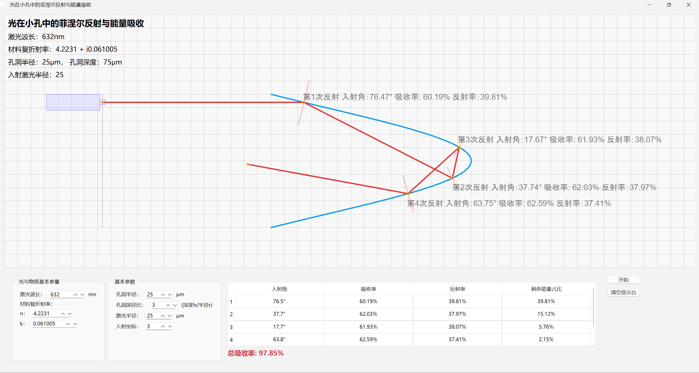

# Laser Fresnel Reflection and Energy Absorption Simulation

  [](./readme/README-ch.md)

A specialized computational physics application implementing Fresnel equations for analyzing angle-dependent laser absorption in Silicon microcavities during femtosecond laser ablation processes.



## Physical Background

During femtosecond laser ablation of Silicon substrates, a distinctive phenomenon emerges: regions with higher cavity density exhibit significantly enhanced etching rates compared to areas with lower cavity density. This enhancement originates from the **multiple reflection enhancement effect** induced by the concave microstructure geometry.

The cavity profile is modeled using a **Gaussian surface function**:

```
y(x) = A · exp(-((x - μ)² / (2σ²)))
```

where `A` represents the amplitude coefficient determined by the geometric constraint:

```
A = (hole_radius × depth_ratio × σ × √(2π)) / (σ × √(2π))
```

Within these microscopic cavities, different spatial components of the incident laser beam correspond to varying **angle of incidence (AOI)** at the cavity walls, which directly correlates with the **angular-dependent absorption coefficient** of Silicon. The complex interplay between incident beam geometry and cavity morphology creates a heterogeneous absorption field, where oblique incidence angles can dramatically alter the **optical coupling efficiency**.

This simulation employs **Fresnel equations** to quantitatively model the angle-dependent laser absorption characteristics of Silicon. The **reflectance coefficients** for s-polarized and p-polarized components are calculated as:

**S-polarized reflectance:**
```
Rs = [(cos(θᵢ) - n·cos(θᵣ)) / (cos(θᵢ) + n·cos(θᵣ))]²
```

**P-polarized reflectance:**
```
Rp = [(cos(θᵣ) - n·cos(θᵢ)) / (cos(θᵣ) + n·cos(θᵢ))]²
```

The **total reflectance** and **absorptivity** are given by:
```
R = (Rs + Rp) / 2
A = 1 - R
```

where `θᵢ` is the incident angle, `θᵣ` is the refracted angle determined by **Snell's law**, and `n` is the **complex refractive index** of Silicon (n = 4.2231 + i·0.061005 at the simulation wavelength).

### Reflection Angle Calculation Algorithm

The simulation implements a sophisticated **geometric ray tracing** approach to determine reflection angles at curved surfaces:

1. **Surface Normal Calculation**: For each collision point on the Gaussian cavity surface, the local **surface normal** is computed using the derivative of the cavity profile:
   ```
   dx/dy = dA/dt · exp(-((t - μ)² / (2σ²))) · (-(t - μ)/σ²)
   ```
   
   The **tangent slope** (dy/dx) and **normal slope** are derived as:
   ```
   tangent_slope = 1 / (dx/dy)
   normal_slope = -1 / tangent_slope
   ```

2. **Incident Angle Determination**: The **relative incident angle** with respect to the surface normal is calculated by:
   ```
   θᵢ_rel = arctan(incident_slope) - arctan(normal_slope)
   ```

3. **Specular Reflection Law**: Following the **law of reflection**, the **relative reflection angle** equals the negative incident angle:
   ```
   θᵣ_rel = -θᵢ_rel
   ```

4. **Absolute Reflection Direction**: The **absolute reflection angle** in the global coordinate system is:
   ```
   θᵣ_abs = arctan(normal_slope) + θᵣ_rel
   reflection_slope = tan(θᵣ_abs)
   ```

5. **Ray-Surface Intersection**: The next collision point is determined by solving the **transcendental equation**:
   ```
   center_y + t - (k·(center_x + A·exp(-((t-μ)²/(2σ²)))) + b) = 0
   ```
   using **Newton-Raphson iteration** with multiple initial guesses to ensure convergence.

The simulation incorporates:

- **Complex refractive index** (n + ik) of Silicon at specific wavelengths
- **Incident angle-dependent reflectance** and **transmittance coefficients**
- **Multiple reflection cascades** within cylindrical cavity geometries
- **Energy deposition profiles** and **absorption enhancement factors**

## Technical Implementation

### Parametric Simulation Control
- **Beam Geometry Configuration**: 
  - **Incident beam radius** (Gaussian beam profile modeling)
  - **Beam positioning coordinates** (x,y spatial positioning control)
  - **Angle of incidence** determination through geometric ray tracing
  
- **Cavity Morphology Parameters**:
  - **Cylindrical cavity radius** (microscale geometric modeling)
  - **Aspect ratio control** (depth-to-radius ratio for cavity geometry)
  - **Surface roughness considerations** for realistic reflection modeling

- **Material Optical Properties**:
  - **Complex refractive index** (n + ik) with wavelength-dependent dispersion
  - **Real part (n)**: Controls refraction and **phase velocity** modulation
  - **Imaginary part (k)**: Governs **extinction coefficient** and absorption losses
  - **Wavelength-specific calibration** for Silicon material properties

## Quick Start

### Prerequisites
- **Python**: Version 3.8 or higher

### Setup

1. Clone the Repository

2. create Virtual Environment

3. Install Dependencies
   ```bash
   pip install -r requirements.txt
   ```

4. Run script `run.py` 
   ```bash
   python run.py
   ```

